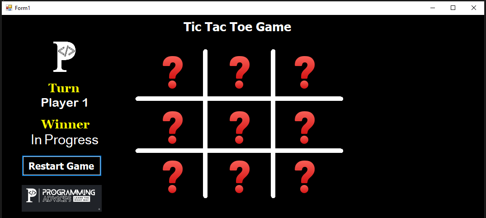
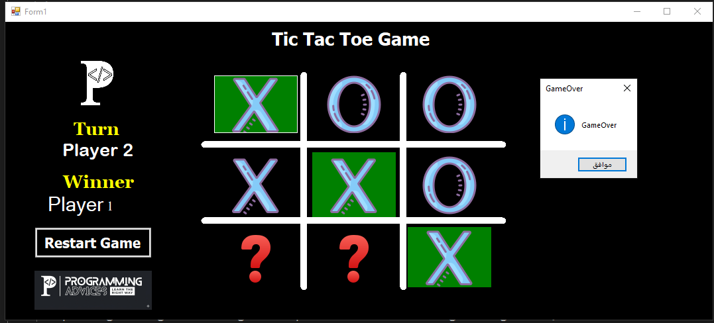

# 💬 Tic-Tac-Toe-Game (v1.0.0)
«A polished X-O game built with C# and WinForms, featuring robust game logic implementation, event handling, and a clean modern user interface.»
---
## 📑 Table of Contents
- [Overview](#overview)
- [Key Features](#key-features)
- [Screenshots](#screenshots)
- [Architecture & Design](#architecture--design)
- [Technologies](#technologies)
- [Acknowledgments](#acknowledgments)
- [License](#license)
- [Author](#author)
---
## Overview
Tic-Tac-Toe-Game (v1.0.0) is a refined desktop implementation of the classic X-O game developed in C# and WinForms. Conceived as a hands-on project to master game logic architecture and user interface state management, the application translates core programmatic concepts into an interactive, seamless gaming experience. 
The system focuses heavily on automated state evaluation, clean event routing, and providing a responsive, visually engaging environment.
---
## Key Features
### 🧠 Smart Logic
- **Automated Winner Detection:** Implements rigorous game state evaluation to instantly identify winning combinations, track player turns, and manage round conclusions.
### 🎨 Modern UI
- **Refined Aesthetics:** Features a clean, balanced color palette, custom icons, and visual themes designed to enhance the overall user experience.
### ⚡ Smooth UX
- **Seamless Gameplay:** Provides instant-reset functionality and responsive event binding to ensure uninterrupted interaction and fluid performance.
---
##  📸 Screenshots

<strong>View Screenshots</strong>

 

### 🖥️ Before Start

### 🏆 Win

---

## Architecture & Design
- **Logic-Centric Structure:** Designed with modular event handling and structured state management to ensure clean code separation, maintainability, and precise control over user interactions.
---
## Technologies

| Technology | Purpose |
| :--- | :--- |
| **C#** | Core programming language |
| **.NET WinForms** | Desktop UI framework environment |

---
## Acknowledgments
Special thanks to Dr. Mohammed Abu-Hadhoud; his curriculum and educational methodology served as a vital guide throughout this project and the broader programming learning journey.
---
## License
This project is open-source and available under the **MIT License**. You are free to use, modify, and distribute it in any way you choose, provided that proper copyright and attribution to the original author are maintained.
---
## Author
- **Developer:** Mohammed Abdullah Noman Qaid Mohammed 
